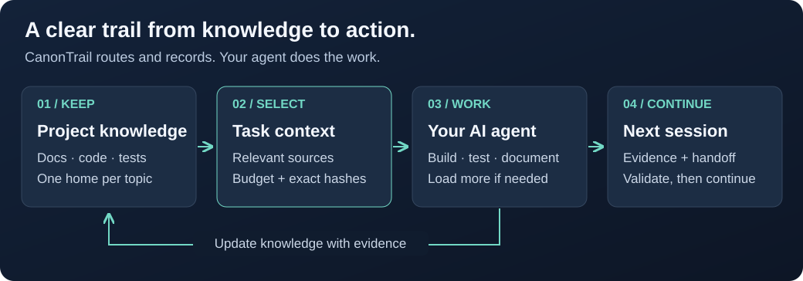

<!-- Generated from ../README.md by scripts/render-readme.js. Do not edit this projection. -->

<h1 align="center">CanonTrail</h1>

<p align="center"><strong>Project knowledge that survives your next AI session.</strong><br>Keep the knowledge. Load the context you need.</p>

<p align="center"><a href="#quick-start">Get started</a> · <a href="#2-give-your-agent-an-entry-point">Copy the AI prompt</a> · <a href="../docs/usage.md">Usage guide</a> · <a href="https://github.com/gardenvision/CanonTrail/releases">Releases</a></p>

---

A new AI session shouldn't mean rediscovering your project.

**CanonTrail turns project documentation into a structured, traceable source of knowledge for coding agents.** Keep one authoritative home for each topic, select the relevant docs and code for a task, and leave a checked handoff for the next session—even when you switch AI providers.

It is a **local CLI + files in your repository**. No CanonTrail account, server or MCP setup is required. Your agent still does the thinking, coding and testing; CanonTrail provides the documentation rules, context selection and continuity checks.

> **Source Alpha · MIT · Windows, Linux & macOS**<br>
> Available to try locally. Still experimental—not a stable release or an npm-published package. [Current limits and evidence](../docs/alpha-readiness.md).

## How it works

<picture>
  <source media="(max-width: 760px)" srcset="../docs/assets/canontrail-flow-mobile.svg">
  
</picture>

**Store broadly. Work selectively. Continue deliberately.** A context lock records which sources were selected, their exact versions and what was left out. When the task needs more knowledge, your agent follows the relevant links and recompiles the selection.

For example: a search feature may need the data model, search rules and a few tests—not your entire deployment history. Missing dependencies can be added explicitly; essential sources are not silently dropped to meet a budget.

## What this helps with

| When your project… | CanonTrail helps you… |
|---|---|
| Spans many sessions or AI providers | Resume from durable decisions, checks and a next safe action. |
| Has a lot of documentation | Route from an overview to the relevant feature, system and code. |
| Has conflicting or outdated notes | Make topic ownership, drafts, evidence and stale sources visible. |
| Already has an established codebase | Discover existing documentation and preview adoption without overwriting files. |

Already using **GSD or Superpowers**? Keep them. They can own planning and execution while CanonTrail organizes knowledge and handoffs. It also works without either. [Integration boundaries](../docs/integrations.md).

## Quick start

### 1. Get CanonTrail once

You need **Node.js 20.19+ and Git** for this route. In a tools/work directory **outside the project you want to work on**, run:

```sh
git clone https://github.com/gardenvision/CanonTrail.git
cd CanonTrail
npm ci --ignore-scripts
npm run build
node dist/cli.js --help
node -p "process.cwd()"
```

The last command prints the absolute folder path: copy it as your `CANONTRAIL_HOME`. You can also ask your local coding agent to run this setup block for you. Keep the folder; the application or repository you want to work on is a **different folder**, your `TARGET_PROJECT`. One CanonTrail copy can serve multiple projects. No global installation is needed.

This downloads the current `main`; record `git rev-parse HEAD` if you need its exact revision. For a reproducible released snapshot, choose a tag from [Releases](https://github.com/gardenvision/CanonTrail/releases) and follow the README shipped with that tag. Do not substitute an unrelated `npx canontrail` package.

### 2. Give your agent an entry point

Open your target project in an agent that can **read local files and run commands**. A web-only chat without file access cannot operate your local checkout.

Copy the prompt below. Replace the three placeholders; the agent can handle the detailed setup and task records.

```text
CANONTRAIL_HOME = <absolute path to the built CanonTrail folder>
TARGET_PROJECT = <absolute path to the project to work on>
MY_TASK = <what I want you to build, fix, review or document>

Use CanonTrail for this task. First verify both paths and confirm that
TARGET_PROJECT is the intended project, not the CanonTrail tool folder.
If you cannot access the files or run the CLI, stop and tell me what is missing.
Read CANONTRAIL_HOME/README.md and follow its linked usage guide as needed.

If TARGET_PROJECT/.agent-context/config.yaml exists, do not run init again.
Read the target's AGENTS.md, config and documentation plan. If setup is
partial or inconsistent, report it instead of overwriting or resetting it.

Otherwise, read existing project instructions and run this preview first:
node "<CANONTRAIL_HOME>/dist/cli.js" init "<TARGET_PROJECT>" --adopt --dry-run
Check the intended scope, scan coverage and every conflict. Only after a
successful, conflict-free, wanted preview, repeat without --dry-run.
Stop for conflicts or incomplete coverage; preserve existing instructions.
Then read the generated AGENTS.md, config and documentation plan.

Choose the correct route: new task, unfinished documentation bootstrap,
or a supplied handoff. For bootstrap, inspect actual code, tests and flows
to discover feature boundaries; keep unknown or unreviewed knowledge draft.
Do not invent features or create a competing documentation tree.

Before implementing, create/update the required task records, index the
docs and compile a bounded context. Inspect required sources, budget and
omissions. Read the selected files or exact sections. Add narrowly needed
sources and recompile when the task reveals missing information.

For a handoff, first validate it; preview and apply a receiving resume
packet/context; validate that exact packet; read its selected sources;
only then continue with the recorded next safe action.

Perform MY_TASK within its scope. Keep documentation, decisions, tests
and uncertainty current. Run the project's relevant checks and CanonTrail
validation, audit and task finalization; report failures honestly.
Before stopping mid-task, leave a validated checkpoint and next safe action.
Setup is not permission for documentation migration, canonical promotion,
Git commits/pushes, or unrelated changes. Ask separately when needed.
```

**That's the entry point—not a new prompt you have to rewrite for every task.** Once adopted, a normal new-task instruction can be as short as:

```text
Use this project's AGENTS.md and CanonTrail setup for the following task:
<my task>. Start with the relevant documentation, compile the task context,
and keep verification and handoff records current.
CanonTrail CLI: <absolute path to CanonTrail>/dist/cli.js
```

For a continuation, also provide the specific task ID and handoff path. Prefer your agent's repository instruction mechanism so future sessions discover `AGENTS.md` automatically; [thin provider bridges](../docs/integrations.md) help route it, but cannot force an agent to comply.

<details>
<summary><strong>Prefer to preview adoption yourself?</strong></summary>

PowerShell:

```powershell
$CanonTrailHome = (Resolve-Path '<CanonTrail source folder>').Path
$TargetProject = (Resolve-Path '<your existing project>').Path
node "$CanonTrailHome/dist/cli.js" init "$TargetProject" --adopt --dry-run
```

macOS / Linux:

```sh
CANONTRAIL_HOME="/absolute/path/to/CanonTrail"
TARGET_PROJECT="/absolute/path/to/project"
node "$CANONTRAIL_HOME/dist/cli.js" init "$TARGET_PROJECT" --adopt --dry-run
```

A dry run writes nothing. Inspect it before applying: an applied adoption can preserve conflicts, create other planned files, and exit with a conflict status. See [safe adoption](../docs/usage.md#safe-adoption) for the full procedure and large-project options.

</details>

## Good to know before you start

- **Your agent writes the knowledge.** Init creates scaffolding and a documentation plan, not a complete, verified understanding of the project.
- **Focused context is the goal, not a savings guarantee.** Estimates are not actual provider-token measurements. Large required files can still dominate; CanonTrail cannot prevent session compaction.
- **Adoption is not migration.** Existing docs and rules are preserved. The [migration path](../docs/migration.md) is narrow, reviewed and experimental—not an automatic rewrite of every document.
- **No remote is needed for ordinary local use.** A readable local Git worktree is required for creating handoffs/checkpoints so uncommitted and untracked files can be disclosed. Unsaved editor buffers are not captured. Application tests and review remain your workflow's responsibility.

## Go deeper

| I want to… | Start here |
|---|---|
| Create tasks, control context or safely resume | [Usage guide](../docs/usage.md) |
| Understand scope and the rules | [Vision](../VISION.md) · [Artifact protocol](../ARTIFACT_PROTOCOL.md) |
| Work alongside GSD or Superpowers | [Integrations](../docs/integrations.md) |
| Coordinate parallel tasks | [Parallel work](../docs/parallel-work.md) |
| Assess adoption or migration of existing docs | [Safe adoption](../docs/usage.md#safe-adoption) · [Migration](../docs/migration.md) |
| Check current limits or contribute | [Alpha readiness](../docs/alpha-readiness.md) · [Roadmap](../ROADMAP.md) · [Contributing](../CONTRIBUTING.md) |
| Work on CanonTrail itself | [AGENTS.md](../AGENTS.md) · [Knowledge map](../docs/self-documentation.md) |

Need help or have feedback? [Open an issue](https://github.com/gardenvision/CanonTrail/issues). For a possible security vulnerability, use the [private reporting route](../SECURITY.md), not a public issue.

## License

[MIT](../LICENSE.txt) for CanonTrail's own code, schemas, templates and documentation, except where stated otherwise. Preserve applicable notices; [third-party materials retain their own terms](../docs/third-party-notices.md). The Alpha is distributed as source; npm publication remains disabled.
